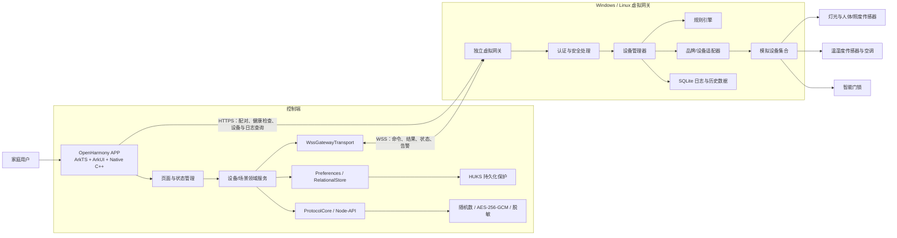
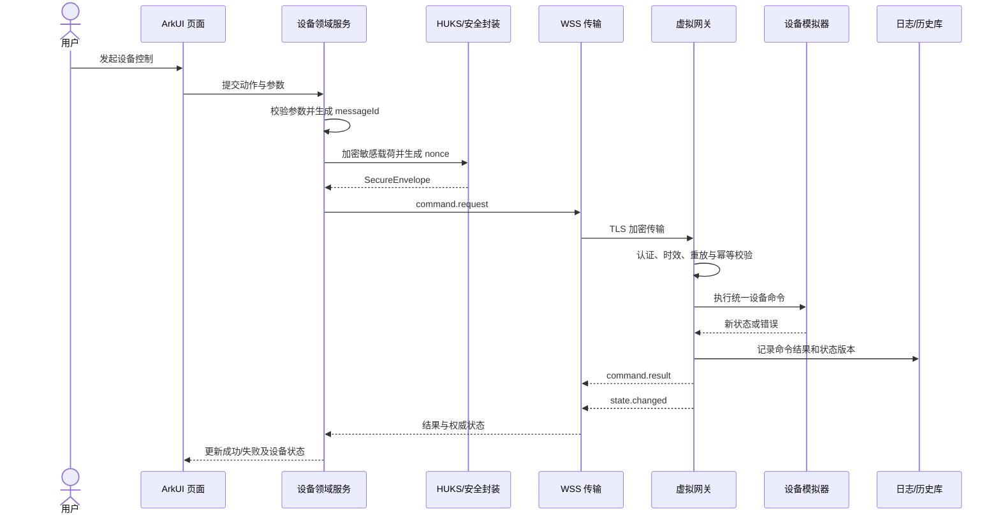
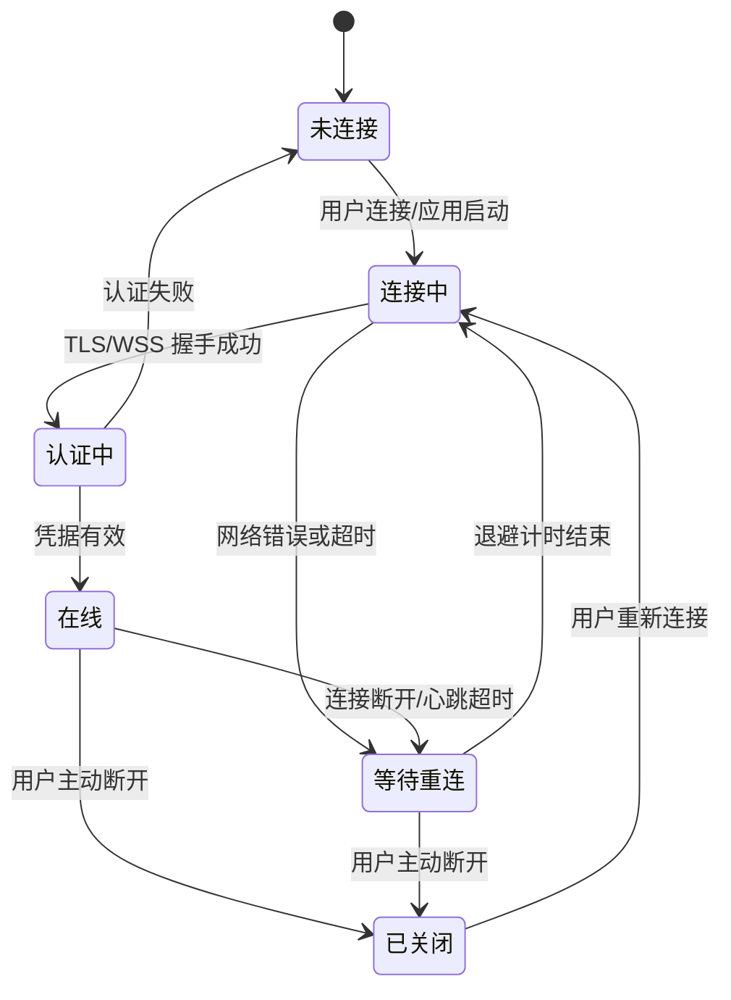

# 基于 OpenHarmony 操作系统的家居设备智能控制系统

## 产品总体设计文档

| 文档属性 | 内容 |
| --- | --- |
| 赛题 | 第十五届“中国软件杯”大学生软件设计大赛 A9——基于 OpenHarmony 操作系统的家居设备控制系统 |
| 文档版本 | V1.1 |
| 文档状态 | 设计基线（含当前实现与后续验收项） |
| 编制日期 | 2026 年 7 月 |
| 适用对象 | 项目开发人员、测试人员、指导教师及大赛评审人员 |

---

## 一、文档说明

### 1.1 编写目的

本文档给出基于 OpenHarmony 的家居设备智能控制系统的总体设计，明确系统目标、边界、架构、核心功能、接口、安全机制、仿真方式和验收标准，为后续开发、测试、演示和材料编制提供统一依据。

本文档描述的是参赛作品的最终目标设计，不表示相应功能在文档编写时已经全部实现。实际交付前，应根据最终代码、HAP 安装包和测试结果同步校正文档。

### 1.2 设计范围

系统由以下三部分组成：

1. **OpenHarmony 控制端 APP**：向用户提供设备状态查看、远程控制、规则配置、告警与日志查询等功能。
2. **独立虚拟网关**：运行在 Windows 或 Linux 电脑上，通过真实网络与 APP 通信，负责设备接入、命令处理、状态推送、自动化规则和安全审计。
3. **模拟家居设备**：由虚拟网关模拟门锁、灯光、人体与照度传感器、温湿度传感器和空调等设备的状态及行为。

首版不采购或接入真实主板、网关、传感器及家电硬件。模拟器与 APP 分进程、分设备运行，确保远程控制、网络中断、安全传输和状态同步均经过真实网络链路，而不是 APP 内部函数调用。

### 1.3 参考资料

- [A9 赛题：基于 OpenHarmony 操作系统的家居设备控制系统](https://www.cnsoftbei.com/content-3-1344-1.html)
- [OpenHarmony 开发者文档](https://docs.openharmony.cn/)
- [OpenHarmony WebSocket 网络访问指南](https://gitcode.com/openharmony/docs/blob/master/en/application-dev/network/websocket-connection.md)
- [OpenHarmony Network Kit Socket API](https://gitcode.com/openharmony/docs/blob/master/zh-cn/application-dev/reference/apis-network-kit/js-apis-socket.md)
- [OpenHarmony 通用密钥库系统 HUKS](https://gitcode.com/openharmony/docs/tree/master/zh-cn/application-dev/reference/apis-universal-keystore-kit)
- [OpenHarmony Preferences 数据持久化](https://gitcode.com/openharmony/docs/blob/master/zh-cn/application-dev/database/data-persistence-by-preferences.md)
- [OpenHarmony RelationalStore 数据持久化](https://gitcode.com/openharmony/docs/blob/master/en/application-dev/database/data-persistence-by-rdb-store.md)
- [OpenHarmony Node-API 概述](https://gitcode.com/openharmony/docs/blob/master/en/application-dev/napi/napi-introduction.md)

### 1.4 术语说明

| 术语 | 说明 |
| --- | --- |
| APP | 本文中的 OpenHarmony 家居设备控制客户端 |
| 虚拟网关 | 独立运行的网关模拟服务，提供 HTTPS/WSS 接口并管理模拟设备 |
| WSS | 基于 TLS 的 WebSocket，用于双向实时通信 |
| HUKS | OpenHarmony 通用密钥库系统，用于生成、保存和使用密钥 |
| 设备状态版本 | 网关为每台设备维护的递增版本号，用于发现并处理并发状态冲突 |
| 品牌适配器 | 将统一空调指令转换成不同模拟品牌指令格式的适配组件 |
| P95 | 95% 的测试样本不超过该数值的性能指标 |

### 1.5 设计原则

- **赛题需求优先**：四大核心功能必须形成可操作、可观察、可测试的闭环。
- **ArkTS + Native C++**：ArkTS/ArkUI 负责页面、业务编排与网络传输，Native C++ 负责安全协议封装、随机数、AES-256-GCM 和诊断脱敏。
- **真实链路仿真**：即使没有实体设备，APP 与网关之间仍使用真实网络协议通信。
- **最小权限与安全默认**：敏感凭据不硬编码、不明文持久化、不写入日志。
- **状态单一来源**：虚拟网关是设备状态的权威来源，APP 本地数据仅作缓存。
- **接口隔离**：业务逻辑不直接依赖具体传输协议、设备品牌或模拟器实现。
- **诚实展示**：品牌控制属于模拟协议适配，不宣称兼容真实厂商私有协议或通过厂商认证。

---

## 二、需求分析与评分映射

### 2.1 建设目标

系统设计为一套以 OpenHarmony 为主要平台的家居设备控制方案，使用户能够远程查看和控制房门、灯光、温湿度和空调状态，并通过独立虚拟网关验证设备联动、协议通信、异常恢复和分层安全机制。同时，系统应验证 HarmonyOS 环境下的构建与核心功能兼容性。

### 2.2 功能需求

| 编号 | 功能域 | 设计要求 | 验收证据 |
| --- | --- | --- | --- |
| F-CC-01 | 控制中心 | 完成网关配对、连接状态展示和断线重连 | 配对记录、连接状态、重连测试 |
| F-CC-02 | 控制中心 | 展示设备列表、类型、分组、在线状态和最近更新时间 | 首页及设备详情页面 |
| F-CC-03 | 控制中心 | 统一下发控制命令并显示处理中、成功或失败结果 | 命令时序与操作日志 |
| F-CC-04 | 控制中心 | 支持设备间的场景联动 | 离家模式、照明自动规则演示 |
| F-LT-01 | 照明中心 | 远程开关灯和调节亮度 | 灯光控制页及状态回传 |
| F-LT-02 | 照明中心 | 根据人体存在与环境照度自动开关灯 | 传感器注入及规则执行记录 |
| F-TH-01 | 温湿度中心 | 实时展示房间温度、湿度及历史趋势 | 仪表盘、折线图及历史数据 |
| F-AC-01 | 温湿度中心 | 控制空调开关、模式和目标温度，并提供除湿模拟 | 空调控制页及环境变化曲线 |
| F-AC-02 | 温湿度中心 | 以统一接口演示海尔、格力、美的三种模拟品牌映射 | 品牌切换及适配器日志 |
| F-DR-01 | 智能门禁 | 远程开门、关门并实时显示门锁状态 | 二次确认、命令结果及状态事件 |
| F-DR-02 | 智能门禁 | 记录门禁操作并对异常状态告警 | 审计日志和告警页面 |

### 2.3 非功能需求

| 编号 | 类别 | 设计要求 |
| --- | --- | --- |
| NF-COMP-01 | 平台 | 在 HarmonyOS 6.1.1 / API 24 环境完成构建、安装和核心功能回归 |
| NF-SEC-01 | 传输安全 | 所有 APP—网关业务通信使用 TLS 1.2 以上的 WSS/HTTPS，并验证服务端证书 |
| NF-SEC-02 | 数据安全 | 敏感控制载荷使用 AES-256-GCM 加密，校验篡改、过期和重放消息 |
| NF-SEC-03 | 密钥安全 | 配对凭据和数据密钥由 HUKS 保护，禁止硬编码和明文落盘 |
| NF-EXT-01 | 扩展性 | 新设备、新品牌和新传输协议通过接口实现，不修改既有业务核心 |
| NF-UX-01 | 易用性 | 界面提供加载、处理中、成功、失败、离线及空数据等完整状态反馈 |
| NF-PERF-01 | 性能 | 同一局域网下命令成功率不低于 99.5%，端到端响应时间 P95 不超过 500 ms |
| NF-REL-01 | 可靠性 | 网关恢复后 10 秒内完成自动重连和全量状态同步 |

### 2.4 评分项对应关系

| 评分项 | 分值 | 本系统设计 | 主要展示或证据 |
| --- | ---: | --- | --- |
| 核心功能完整度 | 60 | 控制中心、照明中心、温湿度与空调、智能门禁形成完整控制闭环 | APP 实机/模拟器演示、网关日志、状态回传 |
| 界面与响应效率 | 10 | 统一视觉、实时状态、操作反馈、性能指标与自动化测试 | UI 页面、1000 次命令测试报告 |
| 可扩展性 | 10 | `GatewayTransport`、设备状态联合类型、`BrandAdapter`、模拟器注册机制 | 架构图、接口定义、新设备扩展示例 |
| 协议与安全 | 10 | WSS＋HTTPS、TLS、AES-256-GCM、HUKS、重放防护与审计 | 证书错误、篡改、重放等安全用例 |
| 文档质量 | 10 | 需求追踪、接口、时序、状态机、测试及风险边界一致 | 本文档及最终校审记录 |

---

## 三、系统边界与运行环境

### 3.1 系统边界

**首版范围内：**

- OpenHarmony APP 的设备控制、数据展示、网关配对和日志查询。
- 独立虚拟网关及其 HTTPS/WSS 服务。
- 灯光、人体/照度、温湿度、空调和门锁设备仿真。
- 自动照明和离家模式等基础设备联动。
- 传输层、数据层和密钥层安全验证。
- HarmonyOS 6.1.1 / API 24 环境构建及核心功能测试。

**首版范围外：**

- 真实国产主板、实体网关和家电设备接入。
- 对海尔、格力、美的真实私有协议的逆向、认证或商用兼容。
- 云端多租户、互联网公网部署、支付和商业化账号体系。
- 生产环境等级的 PKI、灾备、远程运维和合规认证。
- 语音、视觉识别和机器学习预测等非赛题必需能力。

### 3.2 用户角色

| 角色 | 权限与任务 |
| --- | --- |
| 家庭用户 | 配对网关、查看设备、控制灯光/空调/门锁、启停自动规则、查看告警和个人操作记录 |
| 演示维护人员 | 启动虚拟网关、初始化模拟设备、生成配对码、注入故障和导出测试日志 |

首版不设计多用户权限后台。网关以已配对客户端为最小授权单位，未配对客户端不能查询设备或下发命令。

### 3.3 软硬件组成

| 组成 | 目标环境 | 用途 |
| --- | --- | --- |
| 控制端 APP | OpenHarmony 标准系统设备或模拟器 | 主要交付与功能演示 |
| 兼容性验证端 | HarmonyOS 设备或模拟器 | 验证构建、安装、UI 和核心控制流程 |
| 虚拟网关 | Windows 10/11 或主流 Linux，Python 3.11 及以上 | 提供 HTTPS/WSS、规则引擎、模拟设备和日志 |
| 网络 | 同一局域网或同机可达网络 | 承载真实加密通信和故障测试 |
| 实体家居硬件 | 无 | 首版全部以软件仿真实现 |

### 3.4 当前平台基线

| 项目 | 当前交付基线 |
| --- | --- |
| 系统版本 | HarmonyOS 6.1.1 |
| API 级别 | API 24 |
| 应用模型 | Stage |
| 主要语言 | ArkTS + C++ |
| UI | ArkUI 声明式开发 |
| 网络 | `@kit.NetworkKit` WebSocket/HTTP |
| 数据 | Preferences；网关侧 SQLite |
| 密钥 | HUKS + Preferences 密文封装 |
| 构建验证 | Hvigor 生成并签名 HAP |

当前版本不再把 API 20 兼容作为交付目标。若后续需要适配其他 OpenHarmony 发行版，应单独建立 SDK 构建配置和回归矩阵，不影响现有协议与领域模型。

---

## 四、总体架构设计

### 4.1 部署架构



### 4.2 逻辑分层

| 层级 | APP 职责 | 虚拟网关职责 |
| --- | --- | --- |
| 表示层 | 页面布局、交互、可视化、操作反馈 | 无用户界面，仅提供维护日志 |
| 应用层 | 用例编排、输入校验、页面状态转换 | 配对、会话、命令路由、查询接口 |
| 领域层 | 设备模型、场景模型、状态合并 | 设备管理、规则引擎、状态版本和幂等处理 |
| 基础设施层 | NetworkKit、HUKS、Preferences、Node-API/Native C++ | HTTPS/WSS、SQLite、证书、模拟时钟 |
| 设备适配层 | 不直接依赖品牌协议 | 灯光、空调、门锁适配器及设备模拟器 |

### 4.3 技术路线

- APP 采用 ArkTS、ArkUI 与 Native C++ 混合架构，使用 Stage 模型组织生命周期，通过 Node-API 暴露 Native 能力。
- WSS 长连接承担控制命令、命令结果、状态变化和告警事件的低时延双向通信。
- HTTPS 承担配对、健康检查、初始设备快照和分页日志查询。
- 虚拟网关采用 Python 3.11＋FastAPI＋Uvicorn，设备模拟与规则调度使用异步任务实现。
- APP 使用 HUKS 本地 AES-256-GCM 包装密钥加密配对凭据、会话数据密钥和网关地址，将版本号、96 位随机 IV 与密文封装保存在 Preferences；IV 由系统密码框架安全随机数生成器产生，解密材料仅在进程内短暂使用。
- 网关使用 SQLite 保存操作日志、告警和有限周期的环境历史数据。
- Native C++ `ProtocolCore` 负责安全随机 messageId/nonce、规范化 AAD、AES-256-GCM 指令信封、网关消息基本校验和诊断脱敏；网络连接、HUKS 生命周期与业务状态仍由 ArkTS 管理。

### 4.4 控制命令时序



APP 不在收到网关确认前直接把目标状态当作真实状态。页面可显示“处理中”，但最终显示值以 `command.result` 和 `state.changed` 为准。

### 4.5 连接状态机



自动重连间隔为 1、2、4、8、10 秒，之后以 10 秒为上限继续尝试。网关恢复后，APP 应在 10 秒内恢复连接并重新获取全量设备快照。应用进入前台时必须立即检查连接状态；受系统后台策略限制时，不承诺 APP 长时间在后台维持连接。

---

## 五、功能设计

### 5.1 控制中心

控制中心是系统统一入口，承担网关连接、设备概览、状态查询、快捷控制和场景执行。

主要能力如下：

- 首次使用时输入网关地址和一次性配对码，完成客户端注册。
- 展示网关在线状态、最后心跳时间、设备总数、在线数和未处理告警数。
- 从网关获取设备全量快照，按房间或类型筛选设备。
- 设备卡片展示名称、类型、在线状态、关键状态和最近更新时间。
- 所有控制动作显示“处理中、成功、失败、超时”反馈，失败时保留可理解的错误原因。
- 支持“离家模式”：关闭全部灯光和空调，并锁定门锁；任一步骤失败时展示逐设备结果，不把部分成功误报为全部成功。
- 网关断线时保留最近一次缓存状态，但以“离线快照”标识，并禁用可能造成误解的控制按钮。

网关每 15 秒发送心跳或状态事件。连续 45 秒未收到任何有效消息时，APP 将连接标记为离线并进入重连流程。

### 5.2 照明中心

#### 5.2.1 手动控制

- 开关灯。
- 亮度调节范围为 0～100，步长为 1。
- 开灯时若亮度为 0，则恢复上一次非零亮度；关灯不清除亮度记忆。
- 离线、参数非法或命令超时时，不修改权威状态，只显示错误。

#### 5.2.2 人体感应自动控制

每个房间可配置人体存在、环境照度和灯光三个模拟设备。默认自动规则为：

1. 自动模式开启；
2. 检测到有人；
3. 环境照度低于 100 lx；
4. 满足以上条件时自动开灯；
5. 持续 60 秒无人时自动关灯。

照度阈值允许在 10～500 lx 范围内配置，无人延时允许在 5～600 秒范围内配置。用户手动操作灯光后，默认暂停该房间自动规则 5 分钟，避免自动规则立即覆盖用户意图；用户可手动恢复自动模式。

### 5.3 温湿度与空调中心

#### 5.3.1 环境监测

- 温度有效范围为 -10～45 ℃，显示精度为 0.1 ℃。
- 湿度有效范围为 0～100%RH，显示精度为 1%RH。
- 网关默认每 2 秒生成一次模拟遥测并推送最新状态。
- APP 展示当前值、最近更新时间和最近 24 小时趋势；超出有效范围的数据标记为异常，不进入自动规则计算。

无空调干预时，模拟温湿度由基础值、周期变化和随机噪声组成。空调制冷或制热时，温度逐步向目标值收敛；除湿模式下，湿度逐步向 50%RH 收敛，以直观展示控制效果。

#### 5.3.2 空调控制

- 电源开关。
- 目标温度范围 16～30 ℃。
- 模式包括自动、制冷、制热、除湿和送风。
- 查询当前模式、目标温度、运行状态和模拟品牌。
- 切换品牌不改变统一业务模型，只替换网关侧品牌适配器。

#### 5.3.3 模拟品牌适配

| 模拟适配器 | 支持能力 | 示例指令格式 | 边界说明 |
| --- | --- | --- | --- |
| `HaierSimAdapter` | 开关、模式、目标温度 | `HAIER_SIM\|POWER=ON\|MODE=COOL\|TEMP=24` | 自定义演示格式，不代表海尔真实协议 |
| `GreeSimAdapter` | 开关、模式、目标温度 | `GREE_SIM\|PWR:1\|MODE:COOL\|T:24` | 自定义演示格式，不代表格力真实协议 |
| `MideaSimAdapter` | 开关、模式、目标温度 | `MIDEA_SIM\|ON;COOL;24` | 自定义演示格式，不代表美的真实协议 |

品牌适配演示的目的，是证明统一业务命令可以通过适配层转换为不同设备协议格式。作品不宣称控制真实品牌设备，不使用厂商商标暗示合作或认证。

### 5.4 智能门禁

- 门锁状态包括已锁定、已解锁、卡滞和离线。
- 解锁操作必须经过二次确认，并显示目标门锁名称和风险提示。
- 网关执行解锁后默认 10 秒自动上锁；用户可在设置中关闭演示用自动上锁或调整为 5～60 秒。
- 门锁保持解锁超过 60 秒时生成告警；卡滞、离线或连续三次认证失败也生成告警。
- 每次开锁、关锁、自动上锁、失败和告警均记录时间、设备、客户端、结果和原因。
- 清除审计记录属于维护操作，家庭用户页面不提供一键清空入口。

### 5.5 场景与设备联动

首版提供两类可验证联动：

| 场景/规则 | 触发条件 | 动作 |
| --- | --- | --- |
| 自动照明 | 有人且照度低于阈值 | 开灯；持续无人达到延时后关灯 |
| 离家模式 | 用户主动执行 | 关闭全部灯光、关闭全部空调、锁定全部门锁 |

门锁解锁不允许作为无人确认的自动动作。规则由网关执行，即使 APP 短暂断线，已经启用的自动照明规则仍可运行。

### 5.6 页面与交互结构

```text
网关连接/配对
└── 网关地址、证书状态、一次性配对码、连接测试

首页（控制中心）
├── 网关与设备概览
├── 房间/类型筛选
├── 设备卡片
└── 离家模式

照明中心
├── 灯光开关与亮度
├── 人体存在和照度模拟值
└── 自动规则与阈值

温湿度中心
├── 实时温湿度
├── 历史趋势
├── 空调控制
└── 模拟品牌选择

智能门禁
├── 门锁状态与二次确认
├── 自动上锁设置
├── 门禁日志
└── 异常告警

设置与诊断
├── 网关连接信息
├── 安全与重新配对
├── 日志查询
└── 版本及运行环境
```

所有页面统一处理加载中、空数据、离线、错误和无权限状态。颜色不能作为状态的唯一表达方式，关键状态同时使用文字和图标。危险操作使用明确动词，不使用含义模糊的“确定”按钮。

---

## 六、接口与数据设计

### 6.1 APP 传输接口

业务层通过 `GatewayTransport` 使用网关，不直接依赖 NetworkKit 的具体对象。

```typescript
interface GatewayTransport {
  configure(config: GatewayConnectionConfig): void;
  restoreSessionCredential(credential: string): void;
  clearSessionCredential(): void;
  checkHealth(): Promise<boolean>;
  pair(pairingCode: string, clientId: string): Promise<PairingResult>;
  fetchDeviceSnapshot(): Promise<string>;
  connect(): Promise<void>;
  sendCommand(rawCommand: string): Promise<void>;
  subscribe(handler: GatewayMessageHandler): () => void;
  subscribeState(handler: TransportStateHandler): () => void;
  reconnect(): Promise<void>;
  close(): Promise<void>;
}
```

首版实现为 `WssGatewayTransport`。明文凭据仅在传输对象的当前进程内存中短暂使用，持久化由 `GatewaySessionStore` 通过 HUKS 完成。未来若增加 MQTT over TLS 或原始 TLS Socket，应新增 `GatewayTransport` 实现，而不是修改设备业务服务。

### 6.2 设备与状态模型

```typescript
type DeviceType = 'light' | 'environment' | 'airConditioner' | 'doorLock';
type DeviceBrand = 'generic' | 'haierSim' | 'greeSim' | 'mideaSim';

interface DeviceBase {
  id: string;
  name: string;
  roomId: string;
  type: DeviceType;
  online: boolean;
  stateVersion: number;
  updatedAt: number;
}

interface LightState {
  kind: 'light';
  power: boolean;
  brightness: number;
  automationEnabled: boolean;
  manualOverrideUntil: number | null;
}

interface EnvironmentState {
  kind: 'environment';
  temperatureCelsius: number;
  humidityPercent: number;
  presence: boolean;
  illuminanceLux: number;
}

interface AirConditionerState {
  kind: 'airConditioner';
  brand: DeviceBrand;
  power: boolean;
  mode: 'auto' | 'cool' | 'heat' | 'dry' | 'fan';
  targetTemperatureCelsius: number;
  running: boolean;
}

interface DoorLockState {
  kind: 'doorLock';
  status: 'locked' | 'unlocked' | 'jammed';
  batteryPercent: number;
  autoLockAt: number | null;
}

type DeviceState = LightState | EnvironmentState |
  AirConditionerState | DoorLockState;

interface Device<TState extends DeviceState = DeviceState> extends DeviceBase {
  state: TState;
}
```

采用可辨识联合类型后，各设备只包含自身合法字段，避免在一个状态对象中堆叠大量可选属性，也便于编译期校验页面和命令参数。

### 6.3 消息模型

```typescript
type MessageType = 'command.request' | 'command.result' |
  'state.changed' | 'alert.raised';

interface MessageEnvelope<T> {
  protocolVersion: '1.0';
  messageId: string;
  deviceId: string;
  timestamp: number;
  nonce: string;
  type: MessageType;
  payload: T;
}

interface CommandEnvelope<T> extends MessageEnvelope<T> {
  type: 'command.request';
  expectedStateVersion?: number;
}

interface CommandResult {
  protocolVersion: '1.0';
  messageId: string;
  deviceId: string;
  timestamp: number;
  type: 'command.result';
  success: boolean;
  errorCode?: GatewayErrorCode;
  errorMessage?: string;
  stateVersion?: number;
}

interface DeviceStateEvent {
  protocolVersion: '1.0';
  messageId: string;
  deviceId: string;
  timestamp: number;
  type: 'state.changed';
  stateVersion: number;
  state: DeviceState;
}

interface AlertEvent {
  protocolVersion: '1.0';
  messageId: string;
  deviceId: string;
  timestamp: number;
  type: 'alert.raised';
  severity: 'info' | 'warning' | 'critical';
  code: string;
  description: string;
}
```

敏感载荷在传输层发送前转换为安全信封：消息头保留协议版本、消息编号、类型和算法标识，业务载荷加密为 `ciphertext`，并携带 96 位随机 `nonce` 和 GCM `authTag`。同一密钥下不得重复使用 nonce。

### 6.4 网关 HTTPS/WSS 接口

| 方法与路径 | 鉴权 | 用途 | 主要返回 |
| --- | --- | --- | --- |
| `POST /api/v1/pair` | 一次性配对码 | 注册客户端并建立后续凭据 | 客户端编号、凭据材料、过期策略 |
| `GET /api/v1/health` | 无敏感数据；可匿名 | 验证服务可达性和协议版本 | 服务状态、时间、版本 |
| `GET /api/v1/devices` | 已配对凭据 | 获取权威设备全量快照 | 设备列表和状态版本 |
| `GET /api/v1/logs` | 已配对凭据 | 分页查询命令、门禁和告警日志 | 日志页、游标或总数 |
| `WSS /ws/v1/events` | WSS 握手携带已配对凭据 | 双向命令和实时事件 | 命令结果、状态变化、告警 |

接口版本通过路径和 `protocolVersion` 双重标识。新增字段应保持向后兼容；破坏性变更必须升级主版本路径。

### 6.5 错误码

```typescript
type GatewayErrorCode =
  | 'AUTH_FAILED'
  | 'DEVICE_OFFLINE'
  | 'INVALID_COMMAND'
  | 'COMMAND_TIMEOUT'
  | 'STATE_CONFLICT'
  | 'REPLAY_DETECTED'
  | 'RATE_LIMITED'
  | 'INTERNAL_ERROR';
```

| 错误码 | 场景 | APP 处理 |
| --- | --- | --- |
| `AUTH_FAILED` | 凭据无效、撤销或过期 | 清除会话，提示重新配对 |
| `DEVICE_OFFLINE` | 目标设备离线 | 保持原状态，标记离线 |
| `INVALID_COMMAND` | 动作、参数或设备类型不匹配 | 展示参数错误，不自动重试 |
| `COMMAND_TIMEOUT` | 网关或模拟器未在规定时间响应 | 结束处理中状态，可手动重试 |
| `STATE_CONFLICT` | `expectedStateVersion` 已过期 | 拉取最新状态后提示用户重试 |
| `REPLAY_DETECTED` | 消息过期、messageId/nonce 重复 | 拒绝执行并记录安全日志 |
| `RATE_LIMITED` | 配对或命令频率超过限制 | 展示等待时间，不连续重试 |
| `INTERNAL_ERROR` | 网关内部异常 | 展示通用错误并记录诊断编号 |

### 6.6 幂等与并发控制

- 每条命令使用全局唯一 `messageId`。
- 网关缓存最近 5 分钟的命令结果；收到重复 `messageId` 时返回原结果，不重复操作设备。
- 控制命令可携带 `expectedStateVersion`。版本不一致时返回 `STATE_CONFLICT`，避免旧页面覆盖新状态。
- 客户端与网关时钟差允许范围为 ±30 秒；超出范围的敏感命令被拒绝。
- 网关在 5 分钟窗口内记录已使用的 nonce，发现重复值时返回 `REPLAY_DETECTED`。

### 6.7 品牌适配器接口

```typescript
interface NormalizedAcCommand {
  action: 'turnOn' | 'turnOff' | 'setMode' | 'setTemperature';
  mode?: 'auto' | 'cool' | 'heat' | 'dry' | 'fan';
  temperatureCelsius?: number;
}

interface BrandAdapter {
  readonly brand: DeviceBrand;
  supports(command: NormalizedAcCommand): boolean;
  encode(command: NormalizedAcCommand): string;
  decodeState(raw: string): AirConditionerState;
}
```

业务层只产生 `NormalizedAcCommand`。各模拟适配器负责格式转换和能力校验，设备模拟器再解析对应格式。新增品牌只需注册新的适配器，不改变页面及空调领域服务。

---

## 七、状态、数据与仿真设计

### 7.1 状态权威与同步

- 虚拟网关是设备状态的唯一权威来源。
- APP 发出命令后进入待确认状态，不直接修改权威状态。
- 网关为每台设备维护递增的 `stateVersion`；每次有效状态变化后加 1。
- APP 只接受版本号高于本地版本的 `state.changed`，重复或乱序事件被忽略并记录调试日志。
- 建立连接或完成重连后，APP 调用 `GET /api/v1/devices` 覆盖本地设备缓存，再开始处理增量事件。
- APP 重启时先恢复 HUKS 保护的会话，再获取网关全量快照；当前版本不跨进程持久化设备快照。

### 7.2 APP 数据存储

| 数据 | 存储方式 | 安全要求 |
| --- | --- | --- |
| 配对令牌、数据密钥、网关地址 | HUKS + Preferences | HUKS AES-256-GCM 包装；Preferences 仅保存版本、IV 与密文 |
| 当前设备快照 | 进程内存 | 重连后以网关全量快照覆盖，不跨 APP 重启保存 |
| 命令、门禁日志与告警 | 进程内存 | 限量显示，敏感字段脱敏；长期本地历史属于后续扩展 |

### 7.3 网关数据存储

网关当前使用 SQLite 保存审计日志。客户端凭据摘要、会话数据密钥、幂等窗口和设备状态仅存在网关进程内存中，不写入数据库；因此网关进程重启后客户端需要重新配对。后续若持久化网关会话，必须另行引入受保护的服务端密钥和撤销机制。

### 7.4 设备模拟器

| 模拟设备 | 主要状态 | 模拟行为 |
| --- | --- | --- |
| 灯光 | 开关、亮度、在线状态 | 响应开关和调光，支持自动照明规则 |
| 人体/照度传感器 | 人体存在、照度 | 支持自动曲线和手动注入，用于触发规则 |
| 温湿度传感器 | 温度、湿度 | 周期变化、随机噪声、空调干预后的渐进变化 |
| 空调 | 电源、模式、目标温度、品牌 | 解析模拟品牌命令并影响环境状态 |
| 门锁 | 锁定、解锁、卡滞、在线、电量 | 响应开关、自动上锁、低电量和故障注入 |

维护人员可以通过网关启动参数或维护接口注入离线、延迟、命令失败、门锁卡滞、低电量和异常传感器数据，以验证 APP 的异常处理。故障注入接口仅绑定本机管理端口，不通过家庭用户 APP 暴露。

---

## 八、安全设计

### 8.1 威胁与对策

| 威胁 | 可能影响 | 设计对策 |
| --- | --- | --- |
| 中间人监听或篡改 | 泄露家庭状态、伪造控制命令 | WSS/HTTPS＋TLS 1.2 以上、服务端证书验证 |
| 消息重放 | 重复开门或重复执行场景 | 时间戳、唯一 messageId、随机 nonce 和重放窗口 |
| APP 凭据泄露 | 未授权访问设备 | HUKS 保护、日志脱敏、重新配对与凭据撤销 |
| 非法门锁操作 | 家庭安全风险 | 已配对鉴权、二次确认、频率限制和审计日志 |
| 本地数据泄露 | 暴露操作习惯和门禁记录 | 敏感字段加密、数据库安全级别、按期清理 |
| 网关接口滥用 | 拒绝服务或暴力猜配对码 | 限流、失败锁定、输入校验和最小暴露面 |

### 8.2 传输层安全

- 所有业务接口只监听 HTTPS/WSS，不提供明文 HTTP/WS 降级路径。
- 最低协议版本为 TLS 1.2，优先使用运行环境支持的 TLS 1.3。
- 演示环境使用独立演示 CA 签发网关证书，CA 公钥证书随 APP 资源提供；网关私钥仅保存在网关端。
- APP 必须校验证书链、有效期和目标主机，不允许跳过远端验证。
- 证书无效、过期或主机不匹配时中止连接，并在诊断页面显示可理解的错误。

### 8.3 配对与身份认证

1. 网关生成 6 位一次性配对码，有效期 5 分钟。
2. APP 在已验证的 HTTPS 链路上提交配对码和随机客户端编号。
3. 网关验证成功后签发高熵客户端凭据和数据密钥材料；凭据只在配对响应中返回一次。
4. APP 立即使用 HUKS AES-256-GCM 包装凭据、数据密钥和网关地址，Preferences 只保存密文封装。
5. 网关在进程内保存令牌摘要和会话数据密钥，不保存明文令牌，也不把会话材料写入 SQLite 或日志。
6. WSS 握手携带客户端凭据，网关认证通过后才接受命令或订阅事件。

同一来源连续 5 次配对失败后锁定 10 分钟。用户执行“重新配对”或维护人员撤销客户端后，旧凭据立即失效。

### 8.4 数据层保护

- 门锁指令、配对后的敏感控制载荷及敏感日志字段使用 AES-256-GCM。
- GCM nonce 为每条消息独立生成的 96 位随机数，同一密钥下不得重复。
- GCM 认证标签校验失败时拒绝消息，不尝试使用未认证的明文。
- `protocolVersion`、`messageId`、`deviceId`、`timestamp` 和消息类型作为附加认证数据参与校验，防止头部被替换。
- 载荷加密是对 TLS 的分层补充，不替代证书验证和安全传输。
- 不再额外叠加独立 HMAC，避免与 AES-GCM 的完整性认证重复和增加密钥管理复杂度。

### 8.5 密钥生命周期

- 密钥与凭据不得写入 ArkTS/C++ 源码、配置文件、版本库、截图或日志。
- APP 通过固定 HUKS 别名调用加解密操作；Preferences 仅保存版本化密文，ArkTS 业务层只在连接存续期间持有解密后的会话材料。
- HUKS 包装操作使用 AES-256-GCM、96 位随机 IV 和固定版本化 AAD；首次运行时把“密钥不存在”作为正常分支创建密钥，其他 HUKS 错误不得降级为明文保存。
- 为支持启动后后台恢复连接，包装密钥不要求每次弹出用户认证；该选择仅适用于竞赛原型，若进入真实门禁场景应结合系统身份认证、前台解锁和风险分级重新设计。
- 用户重新配对、凭据撤销或达到配置的有效期时生成新凭据和数据密钥，旧材料立即失效。
- 卸载 APP 时由应用沙箱和 HUKS 清理相应数据；网关端仍需通过维护操作撤销旧客户端。
- 日志输出只记录消息编号末尾、设备编号、结果和错误码，不记录令牌、密钥、完整 nonce、密文或门禁敏感参数。

### 8.6 权限控制

首版核心能力仅申请必要的网络权限 `ohos.permission.INTERNET`。由于传感器和设备全部由远端网关模拟，APP 不申请本机传感器、相机、位置、麦克风或外部存储权限。若后续增加二维码扫描或系统身份认证，应单独评估权限并在使用时说明原因。

---

## 九、部署与演示设计

### 9.1 开发与运行环境

| 类别 | 计划配置 |
| --- | --- |
| APP 开发工具 | DevEco Studio，HarmonyOS SDK API 24 |
| APP 构建工具 | Hvigor |
| 网关语言 | Python 3.11 及以上 |
| 网关框架 | FastAPI、Uvicorn、SQLite、标准异步任务 |
| 推荐服务端口 | `8443`，统一承载 HTTPS 与 WSS |
| HTTPS 基址 | `https://<gateway-ip>:8443` |
| WSS 地址 | `wss://<gateway-ip>:8443/ws/v1/events` |

### 9.2 证书准备

1. 在演示环境建立仅用于本项目的演示 CA。
2. 为网关局域网主机名或固定 IP 签发服务端证书。
3. 将网关证书和私钥放在网关受限目录；私钥不进入仓库和 APP。
4. 将演示 CA 的公钥证书作为 APP 原始资源打包，用于验证网关证书。
5. 证书生成脚本只输出公钥证书、网关证书和本地私钥文件，测试结束后妥善保管或销毁私钥。

### 9.3 启动与使用流程

1. 在电脑安装 Python 运行环境和网关依赖。
2. 准备证书和网关配置，启动虚拟网关。
3. 网关初始化客厅灯、客厅环境传感器、客厅空调和入户门锁等默认模拟设备。
4. 使用 HarmonyOS SDK API 24 构建 HAP，安装到设备或模拟器。
5. APP 输入网关 HTTPS 地址并执行健康检查。
6. 在网关生成一次性配对码，在 APP 完成配对。
7. APP 建立 WSS 长连接并获取设备全量快照。
8. 依次演示控制中心、自动照明、温湿度与空调、品牌切换、智能门禁和离家模式。
9. 注入网关断线、门锁卡滞、错误证书或消息篡改，展示错误处理与安全日志。
10. 重启 APP，验证 HUKS 保护的配对材料能够恢复连接且磁盘中不存在明文凭据。

### 9.4 推荐演示设备集

| 设备编号示例 | 名称 | 类型 | 房间 |
| --- | --- | --- | --- |
| `light-living-01` | 客厅主灯 | 灯光 | 客厅 |
| `env-living-01` | 客厅环境传感器 | 环境 | 客厅 |
| `ac-living-01` | 客厅空调 | 空调 | 客厅 |
| `door-entry-01` | 入户门锁 | 门锁 | 入户区 |

默认设备集保持精简，使 7 分钟以内的演示视频能够覆盖全部核心评分点。额外设备只用于证明列表、分组和扩展能力，不应分散核心流程展示。

---

## 十、测试与验收设计

### 10.1 功能测试

| 用例 | 场景 | 预期结果 |
| --- | --- | --- |
| FT-01 | 使用有效配对码连接网关 | 配对成功，HUKS 生成包装密钥并保存会话密文，加载设备快照 |
| FT-02 | 使用错误或过期配对码 | 返回认证错误，不创建客户端凭据 |
| FT-03 | 控制灯光开关和亮度 | 网关返回成功，状态版本递增，APP 显示权威状态 |
| FT-04 | 有人且低照度 | 自动开灯，并生成规则执行记录 |
| FT-05 | 持续无人达到延时 | 自动关灯；未达到延时时保持原状态 |
| FT-06 | 手动控制后触发自动条件 | 自动规则在手动覆盖期内不覆盖用户操作 |
| FT-07 | 查看温湿度实时值和历史趋势 | 当前值持续更新，历史曲线可查询 |
| FT-08 | 空调制冷/制热 | 温度逐步向目标值收敛 |
| FT-09 | 空调除湿 | 湿度逐步向 50%RH 收敛 |
| FT-10 | 切换三种模拟品牌 | 统一命令被不同适配器编码，业务结果一致 |
| FT-11 | 门锁解锁 | 显示二次确认，成功后状态变为已解锁并写入日志 |
| FT-12 | 门锁自动上锁 | 达到设定时间后自动锁定并产生状态事件 |
| FT-13 | 执行离家模式 | 灯光和空调关闭、门锁锁定，逐设备展示结果 |
| FT-14 | 目标设备离线 | 命令失败且 APP 不伪造目标状态 |
| FT-15 | APP 重启 | 从 HUKS/Preferences 恢复未过期会话，连接后获取网关全量快照 |

### 10.2 异常与可靠性测试

| 用例 | 场景 | 预期结果 |
| --- | --- | --- |
| RT-01 | 网关进程停止后恢复 | APP 进入重连，恢复后 10 秒内在线并同步状态 |
| RT-02 | 命令响应超过超时时间 | 返回 `COMMAND_TIMEOUT`，页面结束处理中状态 |
| RT-03 | 重复发送同一 messageId | 网关返回原结果，设备只执行一次 |
| RT-04 | 使用旧状态版本发送命令 | 返回 `STATE_CONFLICT`，APP 拉取最新状态 |
| RT-05 | 状态事件乱序到达 | APP 忽略旧版本，不回滚设备状态 |
| RT-06 | 模拟器抛出内部异常 | 网关返回可追踪错误，其他设备和连接不受影响 |

### 10.3 安全测试

| 用例 | 场景 | 预期结果 |
| --- | --- | --- |
| ST-01 | 使用不受信任或过期证书 | TLS/WSS 连接失败，APP 不允许跳过验证 |
| ST-02 | 使用无效、撤销或过期凭据 | 返回 `AUTH_FAILED`，不能查询或控制设备 |
| ST-03 | 修改 AES-GCM 密文或认证标签 | 解密校验失败，命令不执行并记录安全日志 |
| ST-04 | 重复 nonce 或重放旧消息 | 返回 `REPLAY_DETECTED`，设备状态不变化 |
| ST-05 | 连续猜测配对码 | 达到阈值后返回 `RATE_LIMITED` 并进入锁定期 |
| ST-06 | 检查源码、配置、数据库和日志 | 不包含明文令牌、私钥或数据密钥 |
| ST-07 | 门锁解锁未完成二次确认 | 不生成或发送解锁命令 |
| ST-08 | 在设备端执行 HUKS 持久化闭环 | 首次创建包装密钥，加密保存后可恢复全部字段，清理后不再存在 Preferences 会话密文 |

当前代码已实现 HUKS 密钥首次创建、AES-256-GCM 加密、Preferences 密文写入、HUKS 解密恢复和会话清理。API 24 模拟器联调已执行到健康检查、网关配对和 HUKS 首次保存，并发现部分模拟器在密钥不存在时由 `isKeyItemExist()` 抛出 `12000011`，而不是返回 `false`。当前实现已把该错误作为首次建密钥分支，并隔离 `abortSession()` 的清理异常，Debug HAP 构建通过；修复后的完整保存与恢复闭环仍需重新安装 APP 后补充运行证据，HarmonyOS 6.1.1 真机验证仍未执行。

### 10.4 性能与稳定性测试

在同一局域网、网关和 APP 时间同步、无人工故障注入的条件下执行以下测试：

| 指标 | 测试方法 | 通过标准 |
| --- | --- | --- |
| 命令成功率 | 混合执行灯光、空调和门锁安全命令共 1000 次 | 不低于 99.5% |
| 端到端响应时间 | 从 APP 提交到收到对应 `command.result` | P95 不超过 500 ms |
| 状态同步 | 统计结果后对应 `state.changed` 到达时间 | P95 不超过 1 s |
| 自动重连 | 随机停止网关 30 秒后恢复 | 恢复后 10 秒内连接并完成快照同步 |
| 连续运行 | 持续遥测、心跳和间歇控制 30 分钟 | 无崩溃、无不可恢复断线、状态版本连续 |

测试报告应记录设备、系统版本、网络条件、样本数、成功数、平均值、P95、最大值和失败原因，不能只给出结论截图。

### 10.5 平台与布局测试

- HarmonyOS 6.1.1 / API 24：HAP 构建已通过；安装、首页布局和四大核心功能回归仍需在可用模拟器或真机上执行。
- 验证不同屏幕宽度下卡片、图表、对话框和底部导航无截断或重叠。
- 未经实际构建与运行验证的平台不得在交付材料中宣称兼容。

### 10.6 文档验收

- 每项赛题要求至少对应一个设计章节和一个测试或展示证据。
- 架构图、接口路径、消息类型、错误码和术语在全文保持一致。
- 文档中的版本、性能数据和功能状态必须与最终交付一致。
- 所有模拟品牌和无硬件边界均有明确说明，不作无法验证的真实兼容承诺。
- 提交前检查 Mermaid 图可渲染、代码块可读、表格无错列、链接可访问。

---

## 十一、扩展性设计

### 11.1 新设备类型

新增设备时应完成以下扩展点：

1. 新增明确的设备状态类型和合法命令类型。
2. 在网关实现设备模拟器或实际设备驱动适配器。
3. 通过设备工厂注册类型与适配器，不修改已有设备实现。
4. 为 APP 增加对应控制组件；通用设备列表和连接层无需修改。
5. 增加功能、异常和协议兼容测试。

### 11.2 新空调品牌

新增品牌只实现 `BrandAdapter` 并注册品牌标识。若未来接入真实协议，必须获得合法协议资料或使用厂商公开 SDK，并将模拟适配器与真实适配器使用不同名称，避免混淆。

### 11.3 新传输协议

`GatewayTransport` 将业务与 WSS 隔离。未来可增加 MQTT over TLS 或原始 TLS Socket 实现，但首版只把 WSS 和 HTTPS 列为已设计协议，不宣称已经支持 MQTT、CoAP 或厂商私有协议。

### 11.4 Native C++ 核心模块

当前 APP 固定采用 ArkTS + Native C++ 架构。`ProtocolCore` 通过 Node-API 提供协议和密码学能力，ArkTS 类型声明位于 `types/libentry/Index.d.ts`。扩展 Native 能力时必须同步维护类型声明、错误映射、资源释放和真机测试；Native 层不得自行持久化凭据，也不得绕开 HUKS、权限或证书验证策略。

---

## 十二、风险、限制与应对

| 风险或限制 | 影响 | 应对措施 |
| --- | --- | --- |
| 全软件仿真不能证明真实电气控制 | 无法展示硬件时序、射频和驱动可靠性 | 明确仿真边界，重点验证架构、协议、安全和业务闭环 |
| 模拟品牌协议不是厂商协议 | 不能宣称真实品牌兼容 | 使用 `Sim` 命名和显著说明，展示适配机制而非认证结论 |
| 目标设备与当前 HarmonyOS API 24 环境存在差异 | 可能出现构建或行为不一致 | 仅声明经过实际 SDK 构建和设备回归的平台兼容性 |
| 演示 CA 与生产证书体系不同 | 安全结论不能直接用于商用 | 不关闭证书验证，明确演示环境和生产化改造要求 |
| APP 后台连接受系统策略影响 | 后台期间状态可能延迟 | 前台恢复时立即重连和全量同步，不承诺无限后台保活 |
| 网络波动导致命令结果不确定 | 用户可能重复操作 | messageId 幂等、状态版本、超时反馈和权威状态回查 |
| 设计范围过大影响核心交付 | 核心功能质量下降 | 优先完成四大功能、安全闭环和测试，扩展能力保持接口级设计 |

本方案是竞赛级软件原型设计，不等同于可直接用于真实住宅门禁和家电控制的商用安全系统。进入真实场景前，仍需完成硬件安全、账号权限、隐私合规、渗透测试、证书运维、灾备和厂商协议授权等工作。

---

## 十三、总结

本系统以 OpenHarmony 生态 APP 和独立虚拟网关构成真实网络拓扑，在无实体硬件条件下实现控制中心、照明中心、温湿度与空调中心、智能门禁四类核心功能。系统采用 ArkTS + Native C++ 技术路线，通过 WSS/HTTPS、AES-256-GCM 和 HUKS 分别覆盖传输层、数据层和密钥层安全，并通过设备状态版本、幂等消息、断线重连和权威快照保证状态一致性。

设计将三品牌空调能力限定为可验证的模拟协议适配，并给出量化性能、安全、可靠性和文档验收标准。当前构建基线为 HarmonyOS 6.1.1 / API 24；后续开发与测试应以本文档为基线，并在最终提交前用实际代码、运行效果和测试数据完成一致性校正。

---

## 十四、V1.1 实现校正记录

截至 2026-07-16，设计已落到以下真实模块：

| 设计项 | 实际实现 |
| --- | --- |
| 权威网关 | `DevControl/gateway/devcontrol_gateway/`，FastAPI + HTTPS/WSS + SQLite |
| 协议契约 | `DevControl/protocol/protocol-v1.schema.json` |
| APP 状态仓库 | `entry/src/main/ets/model/DeviceManager.ets`，快照与事件归并、低版本拒绝、待处理命令 |
| 正式传输 | `entry/src/main/ets/service/WssGatewayTransport.ets` |
| 会话保护 | `GatewaySessionStore.ets`，HUKS AES-256-GCM；Preferences 仅保存加密封装 |
| 离线快照 | `DeviceSnapshotStore.ets`，恢复后控制保持禁用，联网后由权威快照覆盖 |
| Native 安全核心 | `entry/src/main/cpp/src/protocol_core.cpp`，系统安全随机数、AES-GCM、诊断脱敏 |
| 自动化与设备 | 网关内灯光、环境、空调、门锁状态机与三种模拟品牌适配器 |
| 维护接口 | 仅监听 `127.0.0.1:18444`，支持离线、卡锁、低电量、延迟和环境注入 |

当前自动化结果为：13 项网关测试通过；合法 CA 的 HTTPS/WSS 端到端链路通过；安全负向用例全部通过；1000 条命令成功率 100%，命令 P95 4.551 ms，状态事件 P95 4.861 ms；30 秒稳定性冒烟内 RSS 增长 0.301 MB。API 24 模拟器联调已证明 HTTPS 健康检查和网关配对可达，并完成 HUKS `12000011` 首次建密钥兼容修复及 HAP 构建验证。修复后的 HUKS 保存/恢复、四业务页面回归、30 分钟稳定性、Native 与网关端侧互通及 APP 前后台恢复仍需设备补证，不能写作已经通过。

### 14.1 本轮完整计划对总体设计的完成情况

本轮实施已经把总体设计从页面原型推进为“独立权威网关 + HarmonyOS 客户端 + 安全协议 + 自动化验收”的可运行系统基线。正式链路不再依赖 APP 本地设备成功模拟，四类设备状态、规则、审计和历史均以网关为权威；Mock 与旧原生模拟能力仅保留在测试边界。

| 计划阶段 | 对总体设计的落实 | 当前结论 |
| --- | --- | --- |
| 需求追踪与工程基线 | 建立协议 1.0 Schema、FT/RT/ST 追踪矩阵、错误码和状态版本规则；清理版本化签名密码与私钥 | 已完成 |
| 权威网关核心 | FastAPI HTTPS/WSS、SQLite、四设备状态机、自动化、三品牌空调适配、配对限流和回环维护接口 | 已完成并通过自动化 |
| APP 架构重构 | 判别联合设备模型、严格解析、`GatewayTransport`、权威快照/事件仓库、待处理命令和中文错误映射 | 已完成并通过构建 |
| 安全端到端链路 | 演示 CA/SAN、Bearer 会话、Native AES-256-GCM、随机 messageId/nonce、HUKS 会话封装、WSS 心跳与重连 | 代码完成；TLS/WSS 自动化通过；HUKS 模拟器回归待完成 |
| 四类业务页面 | 总控、灯光、环境/空调、门锁、设置诊断、离家模式、离线禁用与缓存状态 | 代码完成并通过构建；设备交互回归待完成 |
| 可靠性、安全与性能 | 幂等、重放、版本冲突、错误证书、1000 命令性能、短时稳定性和敏感信息扫描 | 自动化指标通过；30 分钟和前后台/网络切换待设备验证 |
| 文档、演示与发布 | 启动/证书/测试/构建脚本、用户文档、测试报告、追踪矩阵及演示签名 HAP | 本地交付基线完成；正式发布签名和真机证据待补 |

总体上，软件架构、协议、安全边界、网关业务能力和 APP 功能代码已经达到设计目标的实现阶段，现阶段剩余工作主要是设备侧验证与证据收口，而不是继续扩展核心架构。最终验收前必须完成：修复后 HUKS 首次保存与重启恢复、四页面交互、错误证书在 NetworkKit 中的拒绝、网络切换和前后台恢复、HarmonyOS 6.1.1 真机验证以及连续 30 分钟稳定性测试。
